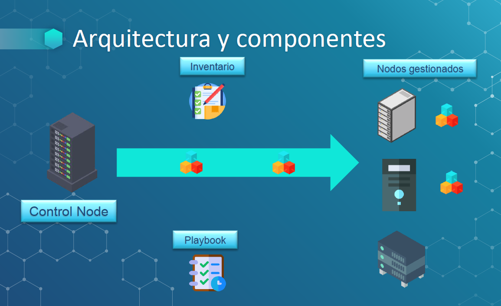

# Ansible

### Definición 
-----

- Ansible es un producto de tipo Open Source que permite gestionar la configuración , la implementación , el aprovisionamiento y la automatización de nuestra infraestructura.

- Tiene gran fiabilidad, consistencia y escalabilidad

- Es una herramienta muy fácil de configurar y utilizar

- No necesita agentes como otros productos, sino que trabaja básicamente a través de SSH

- Es fácil de utilizar ya que usa características de Infrastructure As Code (IaC)

- Esta técnica que permite crear ficheros de configuración, para gestionar y provisionar nuestra infraestructura sin necesidad de realizar procesos manuales

- En el caso de ansible se utilizan unos componentes denominados PlayBooks desde los que se implementa todo el trabajo

### Carácteristicas
-----

- Preparación: nos permite instalar y configurar la infraestructura de TI. Entre ellas tenemos la preparación de servidores, redes, usuarios ,servicios,etc.

- Gestión de la configuración : nos permite configurar de manera rápida y sencilla nuestro entorno. Nos permite mantener los sistemas en un estado “deseado” y correcto.

- Despliegue de aplicaciones se pueden desplegar e instalar aplicaciones a múltiples sistemas y de forma coordinada

- Orquestación: nos permite organizar todos nuestros componentes para que se relacionen de manera correcta.

- Seguridad: nos permite establecer políticas de seguridad para los distintos equipos y entornos con los que trabajemos 

### Arquitectura y componentes
-----

#### Control Nodes

- Son los servidores desde los que se ejecuta Ansible y se lanzan los comandos contra los servidores gestionados.

- Funcionan sobre entornos Linux, aunque puedo utilizar el módulo WSL De Windows para que funcionen dentro de Windows Server.

#### Manages Nodes

- Son los servidores que van a ser gestionados por Ansible.

- Estos servidores se encuentran reflejados dentro de un inventario, que nos permite agruparlos y manipularlos de forma sencilla.

#### Inventario

- Son los ficheros donde incluimos los nodos gestionados, sus agrupaciones y otras características.

- Este fichero puede ser totalmente estático, es decir escrito a mano y manipulado a mano o puede ser dinámico, generado a través de scripts.

#### PlayBooks y Plays

- Un “Play” ejecuta una serie de tareas en los nodos gestionados. 

- Son ficheros creados en formato YAML

- Son de tipo declarativo y por lo tanto de fácil utilización y mantenimiento.

- Puedo agrupar varios Plays dentro de lo que se denomina un PlayBook 

#### Módulos

- Son scripts independientes que podemos ejecutar dentro de un playbook

- Básicamente se trata de librerías con acciones.

- Estos módulos se copian y ejecutan en cada nodo gestionado para ejecutar la acción que se ha definido en la tarea correspondiente

- Hay distintos tipos de módulos para distintas necesidades

#### Colecciones

- Son un formato de distribución que puede estar compuesto de Playbooks, módulos, roles o plugins

#### Arquitectura y componentes

### Referencias

https://www.ansible.com/

https://github.com/ansible/ansible

https://docs.ansible.com/ansible/latest/

https://galaxy.ansible.com

**END**