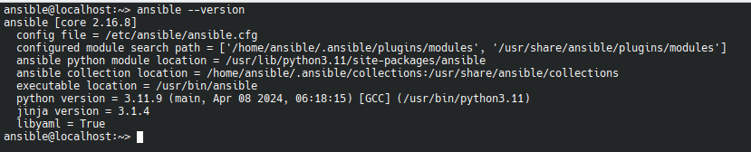

# Ficheros de configuración de Ansible

A continuación vamos a analizar los ficheros principales de configuración de ansible, así como su estructura, su ubicación en el sistema, etc ...

-----
- Tags: #ansible #ficheros_configuración #Estructura
-----

### Definición
-----

Es el fichero principal de configuración que indica a *Ansible* cual va a ser us comportamiento. No es único, es decir, puede haber varios. 

No es la únicamanera de configurar ansible:

- Ansible dispone de varias formas de configurar su funcionamiento:
 
    - A través del fichero de configuración 

    - A través de variables de entorno 
     
    - Opciones en línea de comando

    - Opciones y variables en los **playbooks**


##### El fichero principal de ansible se denomina **ansible.cfg**

- Este fichero esta formado por un conjunto de opciones y propiedades que ya tienen un valor predefinido y que se necesita cambiar a través de este fichero.

- Por tanto, solo necesito modificar el fichero si quiero cambiar algún valor original.

 ### Ubicación
-----

 Este fichero se puede encontrar en los siguientes sitios: 

 - **ANSIBLE_CONFIG**. Variable de entorno del sistema linux.

 - **Ansible.cfg**. Ubicado en el directorio actual. Nos da la posibilidad de tener un archivo de configuración por proyecto.

 - **~/.ansible.cfg**. Ubicado en el directorio home del usuario. Este afectará a todos los proyectos que cuelguen de ese usuario.

 - **/etc/ansible/ansible.cfg**. 

> Si no encuentra, ninguno de estos ficheros, *ansible* nos mostrará un error. 

> Hay que tener en cuenta que si hemos realizado la instalación mediante un gestor de paquetes, entonces el fichero se encontrará en el directorio *"/etc/ansible/ansible.cfg"*.

> Si hemos realizado la instalación mediante **pip**, tenemos que generarlo incialmente, aunque algunos generan uno en el directorio del usuario.


### Generar el fichero de configuración manualmente.
-----

En el caso de que el fichero de configuración no se haya generado, utilizamos el siguiente comando para generarlo. 

- Generación del fichero **Ansible.cfg**

    `ansible-config init --disabled > ansible.cfg`

	>El flag **--disabled ** crea el fichero con todas las lineas comentadas


### Saber la ubicación del fichero **ansible.cfg**
-----

Para no volvernos locos en caso de que no encontremos el fichero de configuración de ansible usamos el siguiente comando 

- Saber la ubicación del fichero:

    

> En este caso, ansible nos informará sobre la ubicación del fichero. 


### Estructura del fichero
----- 

- El fichero de configuración, normalmente suele tener la siguiente estructura

    ```cfg
    [defaults]
    inventory = ./inventory
    [privilege_escalation]
    become=True
    become_method=sudo
    become_user=root
    become_ask_pass=True
    ```

    > Como se puede observar, normalmente suele estar estructurado de manera **(Propiedad = Valor)**. 

    > Al ser un fichero de tipo **INI** se pueden realizar agrupacioens. 

- Los campos mas populares y que formarían parte de la sección **[privilege_escalation]** son: 

	- **become**: (true/false) -> Usado para especificar como escalar privilegios
	- **become_method**: (sudo, por ejemplo) -> método de escalado
	- **become_user**: usuario de escalado
	- **become_ask_pass**: (true/false) -> si debe pedir la contraseña

- Se pueden poner comentarios.

    - **#**. Con el uso de la almohadilla, para comentar toda la línea

    - **;**. Para comentar partes de la línea. 


**END**