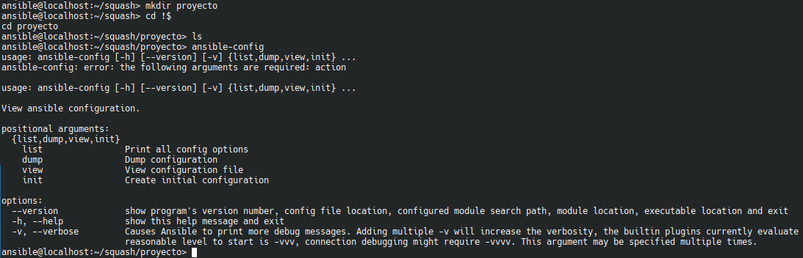
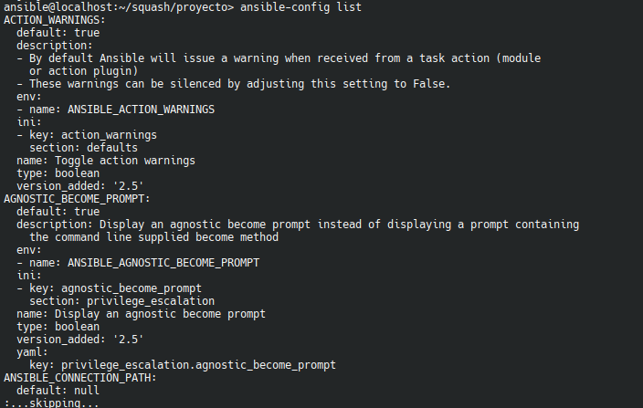
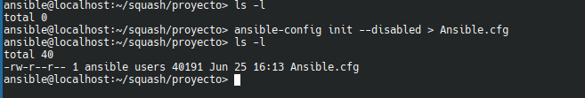

# Fichero de configuración de ansible de ejemplo

Análizamos un fichero de configuración completo de ejemplo

-----
- Tags: #ansible #fichero_configuración
-----

### Fichero de configuración **Por defecto**
-----

Es el fichero predeterminado de [ansible](../00_Intro/00_Ansible.md) y puede ser muy amplio, ya que contiene numerosas configuraciones, como puden ser variables, plugins, etc.

### Fichero de configuración personalizado
-----

En este caso, vamos a generar un fichero personal en el directorio de trabajo de nuestro proyecto. Para ello, creamos el fichero mediante el uso del siguiente comando:

- Generamos el directorio de nuestro proyecto y utilizamos **ansible-config**

    

- **(ansible-config list)**. Listamos las configuraciones predefinidas de ansible.

    

- Generamos nuestro fichero

    

> Como podemos ver, con este comando generamos el mismo fichero que viene por defecto, con todas las configuraciones, variables y plugins, registrados. 

**END**