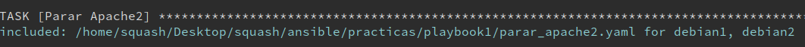

# Incluir tareas desde ficheros externos

-----
- Tags: #ansible #playbooks #tasks #tareas #ficheros_externos #include_tasks
-----

### Uso de ficheros externos para incluir tareas

En este apartado lo que se pretende es mostrar como se pueden incluir tareas que se han definido en otros playbook a que estamos creando. 

#### En primer lugar vamos a añadir un nuevo play.

Con este nuevo play, se pretende copiar un fichero *index.html* en nuestras máquinas con el servidor *nginx* activo para que nos muestre este fichero en lugar de la página principal de nginx.

- Añadimos el nuevo play:

	```yaml
	---
	- name: Primer playbook del curso modificado
	  hosts: all
	
	  tasks:
	  - name: Emitir un ping a todas las máquinas
	    ansible.builtin.ping:
	  - name: Crear un fichero
	    ansible.builtin.shell:
	      touch /tmp/fichero1.txt
	
	- name: Instalar Nginx
	  hosts: debian
	
	  tasks:
	  - name: Parar Apache2
	    ansible.builtin.service:
	      name: apache2
	      state: stopped
	
	  - name: Instalar Nginx
	    ansible.builtin.apt:
	      name: nginx
	      state: present
	      update_cache: true
	
	  - name: Iniciar Nginx
	    ansible.builtin.service:
	      name: nginx
	      state: started
	
	- name: Modificar el fichero index.html
	  hosts: debian
	
	  tasks:
	  - name: Copiar el nuevo fichero
	    ansible.builtin.copy:
	      src: ./index.html
	      dest: /var/www/html/index.html
	      owner: root
	      group: root
	      mode: '0644'
	...
	```


	> Como se puede observar el play con nombre "Modificar el fichero index.html" añadido al final, tiene como objetivo copiar un fichero de la máquina local a la remota, teniendo en cuenta parametros como:
	> 	- **owner** -> propietario de fichero.
	> 	- **group** -> grupo.
	> 	- **mode** -> modo de escritura, lectura y ejecución.

#### Uso de playbooks externos 

El objetivo es tener módulos y tareas externas compartidas que se puedan utilizar en otros playbooks sin la necesidad de repetir dichas tareas. 

- Para incluir tareas de ficheros externos se utiliza la clausula **include_tasks**

	```yaml
	---
	- name: Primer playbook del curso modificado
	  hosts: all
	
	  tasks:
	  - name: Emitir un ping a todas las máquinas
		ansible.builtin.ping:
	  - name: Crear un fichero
		ansible.builtin.shell:
		  touch /tmp/fichero1.txt
	
	- name: Instalar Nginx
	  hosts: debian
	
	  tasks:
	  - name: Parar Apache2
		include_tasks: parar_apache2.yaml
	
	  - name: Instalar Nginx
		ansible.builtin.apt:
		  name: nginx
		  state: present
		  update_cache: true
	
	  - name: Iniciar Nginx
		ansible.builtin.service:
		  name: nginx
		  state: started
	
	- name: Modificar el fichero index.html
	  hosts: debian
	
	  tasks:
	  - name: Copiar el nuevo fichero
		ansible.builtin.copy:
		  src: ./index.html
		  dest: /var/www/html/index.html
		  owner: root
		  group: root
		  mode: '0644'
	...
	```

- Fichero *.yaml* que contiene la tarea:

	```yaml
	- name: Parar apache2
	  ansible.builtin.service:
	    name: apache2
	    state: stopped
	```

	> Hay que dejar claro que en este fichero solo hay que incluir la tarea, no hay que empezar el fichero como si fuera un nuevo playbook

- En el momento de ejecución del playbook principal, se indicará que se va a incluir una nueva tarea ubicada en el fichero en el cual se haya implementado. La imagen siguiente muestra este paso: 

	


**END**